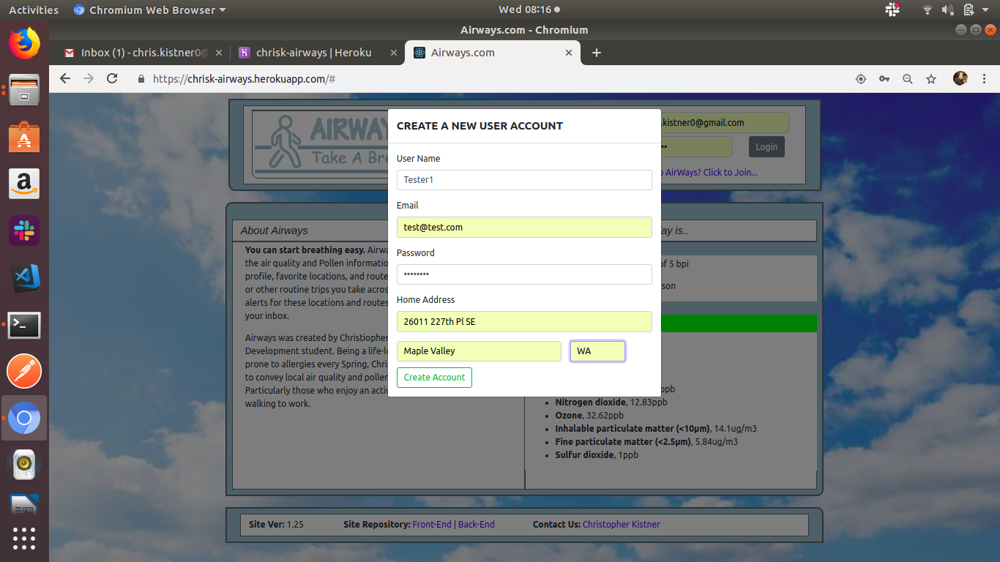
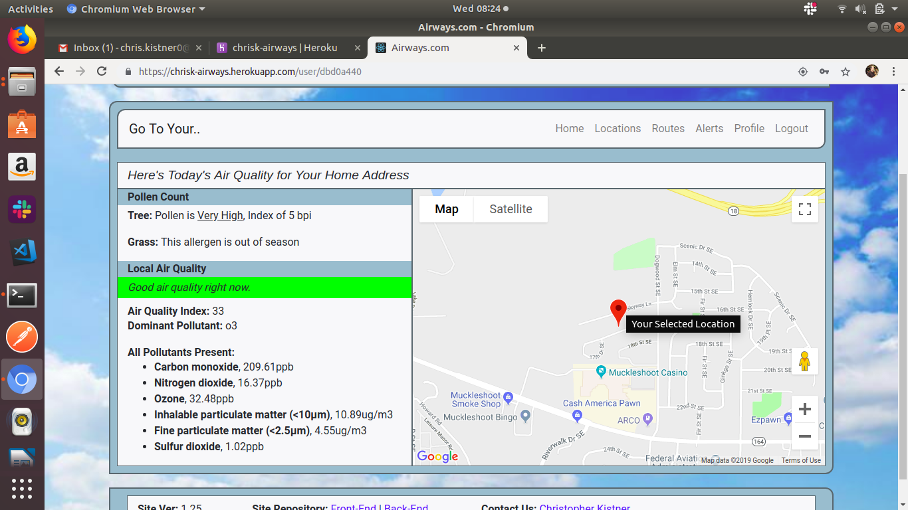
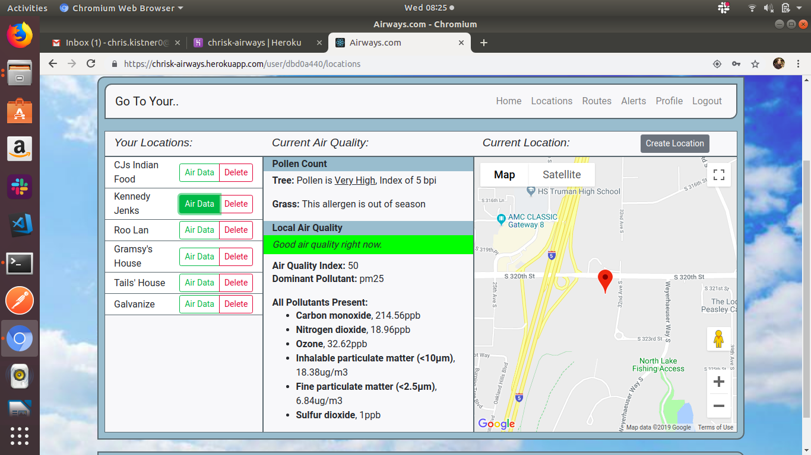
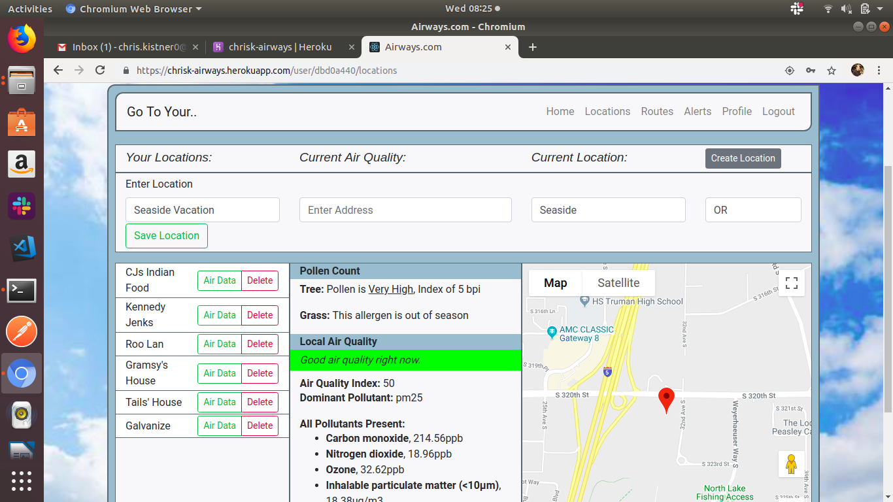
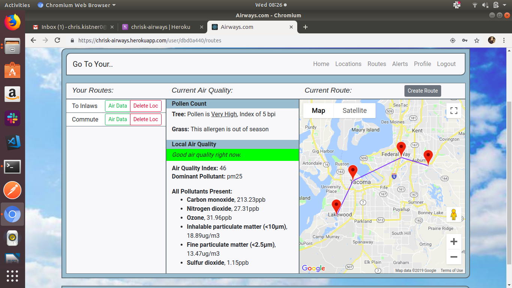
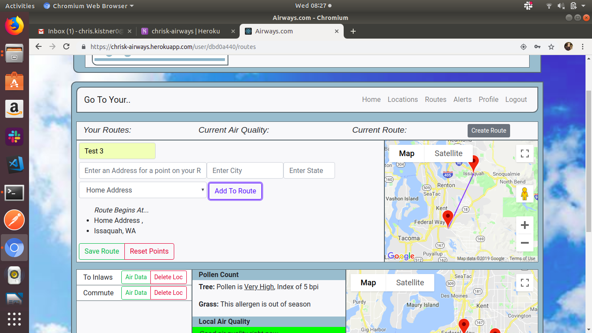
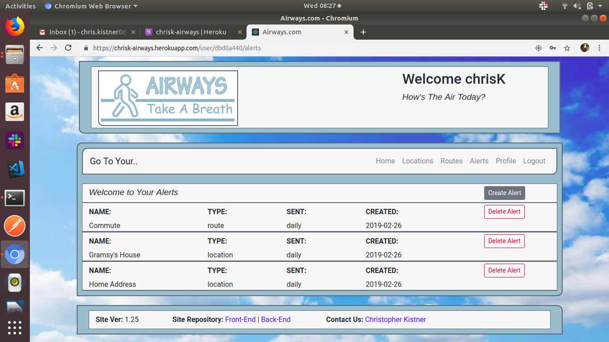
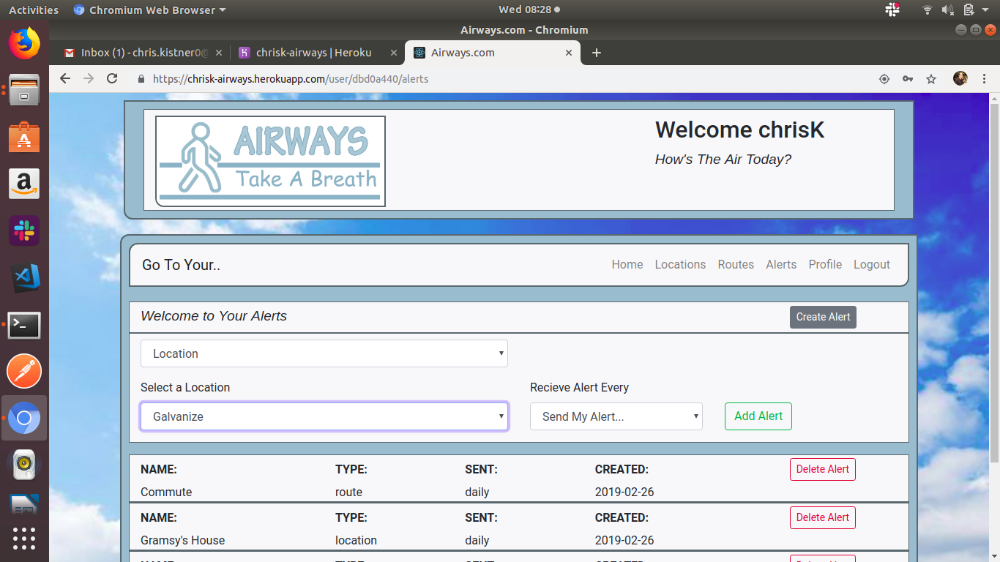
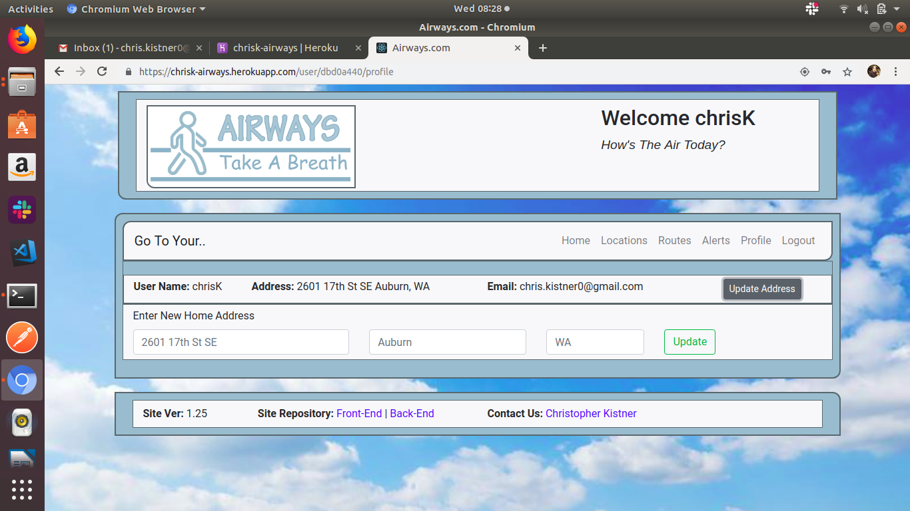

# airways-front-end 2/28/2019
Front-End for Galvanize capstone project, Airways

# Description
Airways is a site dedicated to helping asthmatics and those with allergies navigate daily life better by letting them know what they're breathing. Major differences in air quality between a person's home and their job can seriously impact an asthmatics day, especially if they live an active lifestyle. Should I bike to work or drive? Do I need to take my allergy medication this morning even though it makes me drowsy? Airways allows such individuals to get up to the minute air and pollen data about any location in the USA they choose. User's can also create routes for their daily commute, trips, and journey's around town and then elect to have email alerts sent to them with daily reports on air quality. Airways let's you breath easy.

#Operational Requirements
Airways makes use of several third-party APIs to operate. User's will need to sign up and acquire API Keys for the follwing applications before Airways can be used:

1. Breeze-O-Meter
2. Google Maps

Key's along with the URL's for the Get requests must be placed in a .env.development file created in the primary project directory. The URL and API variable names are listed below however you will need to add your own keys.

SECRET='Whatever kind of SECRET phrase you want to use'

GOOGLE_GEOCODE_URL=https://maps.googleapis.com/maps/api/geocode/json?address=
GOOGLE_API_KEY='Your own key goes here'

BREEZE_O_METER_API_KEY='Your own key goes here'
BREEZE_O_METER_CURRENT_CONDITIONS_URL=https://api.breezometer.com/air-quality/v2/current-conditions?
BREEZE_O_METER_POLLEN_URL=https://api.breezometer.com/pollen/v2/forecast/daily?

#API Usage Warning
Breeze-O-Meter is not free to access. As of the day this README was drafted you can sign up for a 15-day free trial and get a key that will enable all of Airways functions. However trial keys only allow you to make 1000 calls a day to the API so extensive use isn't recomended.

## How-to

Upon arriving at the login page users are prompted to either create a new account or login to an existing one.

Users will then be taken to their home page. The Address they entered when joining is now their Home Address, and the Google Maps Marker will be placed on it, along with Breeze-O-Meter data for that longitude and latitude value. From here users can click on one of several options, the first being Locations.

In Locations, users can create specific locations important to them that they want to get air quality data for. Clicking the Air Data button next to a location's name allows the user to immediately pull the current data from Breeze-O-Meter. They can also create and save as many Locations as they want.

In Routes, users can create a series of locations called routes, mimicking their daily commute or routine trips across town. By clicking on a marker for a specific point along a route users can get that areas specific air quality data and see how the conditions may change as they travel. They can also create a new route and save as many as they want either by entering new locations themselves or pulling from their saved Locations.

In Alerts, users can elect to have the air quality conditions for a specific location or route emailed to them. User's can select from their saved locations and routes and specify how often they want to recieve an alert. Warning, deleting a location or route will also delete its corresponding alert.

Finaly should a user move, they can update their Home Address settings on the Profile page.

## Available Scripts

In the project directory, you can run:

### `npm start`

Runs the app in the development mode. 
Open [http://localhost:3000](http://localhost:3000) to view it in the browser.

The page will reload if you make edits. 
You will also see any lint errors in the console.

### `npm test`

Launches the test runner in the interactive watch mode. 
See the section about [running tests](https://facebook.github.io/create-react-app/docs/running-tests) for more information.

### `npm run build`

Builds the app for production to the `build` folder. 
It correctly bundles React in production mode and optimizes the build for the best performance.

The build is minified and the filenames include the hashes. 
Your app is ready to be deployed!

See the section about [deployment](https://facebook.github.io/create-react-app/docs/deployment) for more information.

### `npm run eject`

**Note: this is a one-way operation. Once you `eject`, you can’t go back!**

If you aren’t satisfied with the build tool and configuration choices, you can `eject` at any time. This command will remove the single build dependency from your project.

Instead, it will copy all the configuration files and the transitive dependencies (Webpack, Babel, ESLint, etc) right into your project so you have full control over them. All of the commands except `eject` will still work, but they will point to the copied scripts so you can tweak them. At this point you’re on your own.

You don’t have to ever use `eject`. The curated feature set is suitable for small and middle deployments, and you shouldn’t feel obligated to use this feature. However we understand that this tool wouldn’t be useful if you couldn’t customize it when you are ready for it.

## Learn More

You can learn more in the [Create React App documentation](https://facebook.github.io/create-react-app/docs/getting-started).

To learn React, check out the [React documentation](https://reactjs.org/).

### Code Splitting

This section has moved here: https://facebook.github.io/create-react-app/docs/code-splitting

### Analyzing the Bundle Size

This section has moved here: https://facebook.github.io/create-react-app/docs/analyzing-the-bundle-size

### Making a Progressive Web App

This section has moved here: https://facebook.github.io/create-react-app/docs/making-a-progressive-web-app

### Advanced Configuration

This section has moved here: https://facebook.github.io/create-react-app/docs/advanced-configuration

### Deployment

This section has moved here: https://facebook.github.io/create-react-app/docs/deployment

### `npm run build` fails to minify

This section has moved here: https://facebook.github.io/create-react-app/docs/troubleshooting#npm-run-build-fails-to-minify
